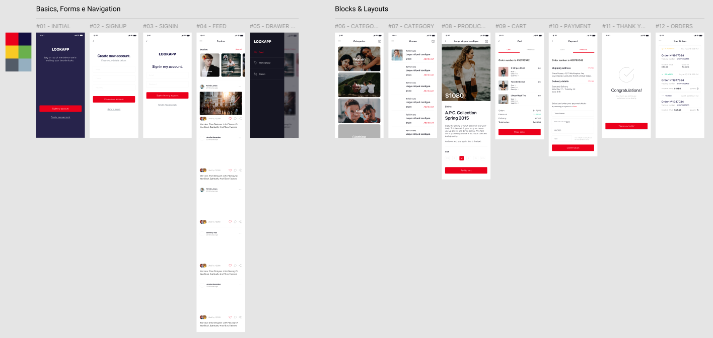

### Projeto React Native - LookApp

Este projeto é uma aplicação mobile desenvolvida utilizando React Native, trata-se de uma ideia de rede social com marketplace, feito com as aulas do **DevClub**. Abaixo estão listadas as principais tecnologias utilizadas no desenvolvimento deste projeto, juntamente com uma breve descrição de cada uma.

### 👉 Tecnologias Utilizadas

- **Styled-components:** Biblioteca para estilização de componentes em React Native, utilizando uma sintaxe baseada em CSS-in-JS.

- **react-native-vector-icons:** Biblioteca que fornece um conjunto de ícones personalizáveis para uso em aplicações React Native.

- **React Navigation:** Biblioteca para navegação entre telas em aplicativos React Native.

- **Navigation Stack:** Parte do React Navigation que permite a navegação por pilha (stack navigation), onde as telas são empilhadas e desempilhadas, facilitando a navegação entre diferentes telas.

- **Navigation Drawer:** Parte do React Navigation que implementa um menu lateral (drawer navigation) que pode ser deslizado a partir da borda da tela.

- **Picker:** Componente para seleção de itens a partir de uma lista de opções.

- **react-native-stretchy:** Biblioteca que facilita a criação de cabeçalhos (headers) expansíveis e colapsáveis em aplicativos React Native.

- **API com json-server:** Ferramenta para simular uma API RESTful utilizando arquivos JSON, útil para desenvolvimento e testes de funcionalidades de backend.

- **axios:** Biblioteca para realizar requisições HTTP, utilizada para comunicação com APIs.

- **React Native Async Storage:** Biblioteca para armazenamento persistente de dados no dispositivo, como armazenamento de chave-valor.

- **Card Validator:** Biblioteca para validação de números de cartões de crédito, garantindo que os números inseridos sigam os padrões de cartões válidos.

- **API Context:** API do React para gerenciamento de estado global, permitindo o compartilhamento de dados entre componentes sem a necessidade de passar props manualmente.

- **Moment:** Biblioteca para manipulação e formatação de datas e horas, facilitando operações como cálculo de diferenças e formatação de datas em diversos formatos.

### 👇 Apresentação

Este README fornece uma visão geral básica das tecnologias e ferramentas utilizadas no projeto. Para mais detalhes sobre a implementação de cada uma, consulte a documentação oficial das bibliotecas e ferramentas mencionadas.
